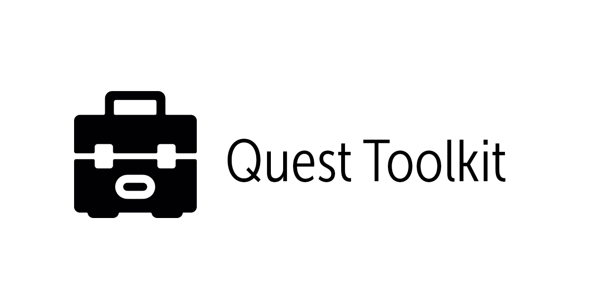

# Want to talk about this project

[Join Discord](https://discordapp.com/invite/hgwCxtJ)
# Quest Toolkit

Quest Save tool is a command line interface for backing up and restoring save data for games on the oculus quest headset. (and eventually for the oculus go)

To use this tool you will need to enable developer mode on your headset and plug the cable into both your computer and the headset before running the program.

# Installation - From Source
To run the latest version of this software clone the repo and run:
`npm install`
then
`node index.js`

# Installation - From Release
To run the release on Linux or OSX make sure to run the following command in a terminal in the folder where you extract the zip file

`chmod +x ./Quest-Toolkit-<OSX/Linux>`

`./Quest-Toolkit-<OSX/Linux>`
